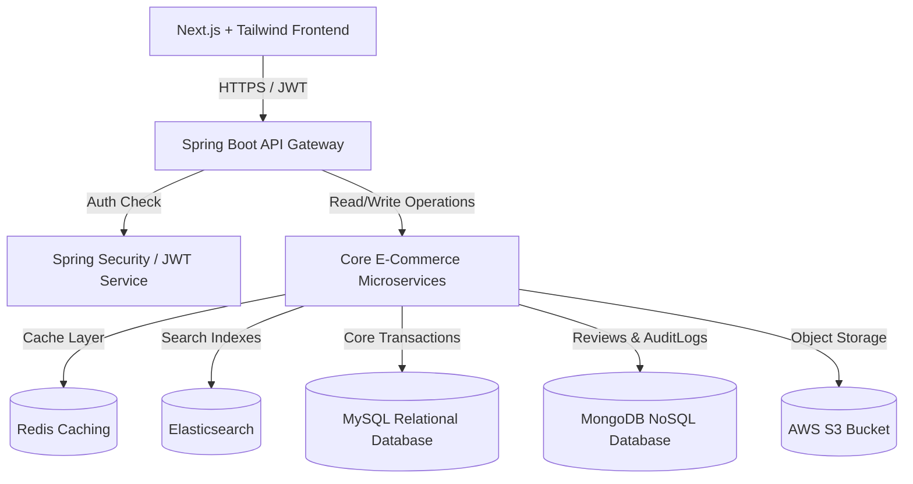
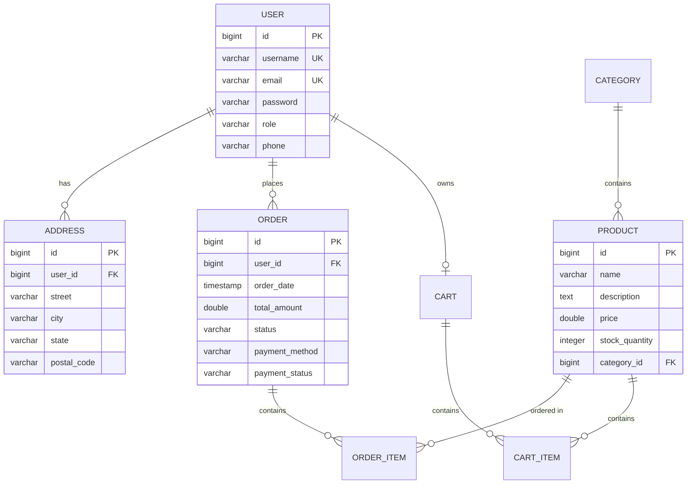

# Software Requirements Specification (SRS) & System Design
## Enterprise E-Commerce Platform (inspired by Amazon & Flipkart)

---

## 1. Document Overview
This document specifies the software requirements, system architecture, database design, and interface specifications for the Enterprise E-Commerce Platform.

---

## 2. Functional Requirements

### 2.1 User Management & Security
- **Authentication**: Email/Password login, SMS OTP Login, Google OAuth2.
- **Roles**: 
  - `CUSTOMER`: Browse products, write reviews, manage cart/wishlist, checkout, view order history.
  - `SELLER`: CRUD own products, track inventory, view sales metrics, manage dispatch status.
  - `ADMIN`: Global system oversight, category management, seller registration validation, system log audits, sales report generation.
- **Profile Management**: Multiple shipping addresses, default payment methods.

### 2.2 Product Catalog & Search
- **Categories & Products**: Infinite nested categories, detailed product specifications (variant management).
- **Search & Filter**: Real-time fuzzy search powered by **Elasticsearch** with aggregations (filter by rating, price range, brand, category, in-stock).
- **Voice & Image Search**: Query parsing from speech input or uploaded image characteristics.

### 3. Non-Functional Requirements
- **Performance**: API response times under 200ms for catalog reads using **Redis** caching.
- **Scalability**: Stateless architecture supporting horizontal scaling (Docker + Kubernetes).
- **Security**: OWASP Top 10 mitigation (SQL Injection, XSS, CSRF protection, BCrypt salting, Rate limiting).
- **Availability**: High availability active-active clustering.

---

## 4. System Architecture Diagram



---

## 5. Entity-Relationship (ER) Schema (MySQL)



---

## 6. NoSQL Schema Layout (MongoDB)

### 6.1 Product Reviews Collection (`reviews`)
```json
{
  "_id": "ObjectId",
  "productId": "Long",
  "userId": "Long",
  "username": "String",
  "rating": "Integer (1-5)",
  "comment": "String",
  "createdAt": "Timestamp"
}
```

### 6.2 System Audit Logs Collection (`activity_logs`)
```json
{
  "_id": "ObjectId",
  "userId": "Long",
  "username": "String",
  "action": "String (LOGIN/ORDER_PLACE/INVENTORY_UPDATE)",
  "details": "String",
  "ipAddress": "String",
  "timestamp": "Timestamp"
}
```
